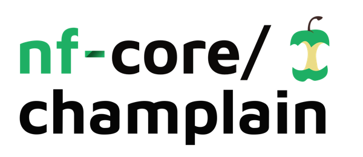

<h1>
  <picture>
    <source media="(prefers-color-scheme: dark)" srcset="docs/images/nf-core-champlain_logo_dark.png">
    
  </picture>
</h1>

[](https://github.com/nf-core/champlain/actions/workflows/ci.yml)
[](https://github.com/nf-core/champlain/actions/workflows/linting.yml)[](https://nf-co.re/champlain/results)[](https://doi.org/10.5281/zenodo.XXXXXXX)
[](https://www.nf-test.com)

[](https://www.nextflow.io/)
[](https://docs.conda.io/en/latest/)
[](https://www.docker.com/)
[](https://sylabs.io/docs/)
[](https://cloud.seqera.io/launch?pipeline=https://github.com/nf-core/champlain)

[](https://nfcore.slack.com/channels/champlain)[](https://twitter.com/nf_core)[](https://mstdn.science/@nf_core)[](https://www.youtube.com/c/nf-core)

## Introduction

**The AGTC nf-core/champlain** is a bioinformatics pipeline for preprocessing of sequencing data coming from the Advanced Genome Technologies Core at UVM. It can handle Singular, Geoxm and Nanopore Data.

0. Concatenate samples if necessary
1. Read QC ([`FastQC`](https://www.bioinformatics.babraham.ac.uk/projects/fastqc/))
2. Present QC for raw reads ([`MultiQC`](http://multiqc.info/))

## Usage

Go to the VACC, make sure to have nextflow installed and run:

```bash
sbatch runChamplain.sh samplesheet.csv instrumentType outputDirectory datadirectories
```

* Samplesheet: For singular data, the samplesheet would be regular Singular sample sheet.
* Instrument Type: singular, nanopore or geomx
* outputDirectory: where you want the output to go
* datadirectories: where the fastq data is located

## Pipeline output

To see the results of an example test run with a full size dataset refer to the [results](https://nf-co.re/champlain/results) tab on the nf-core website pipeline page.
For more details about the output files and reports, please refer to the
[output documentation](https://nf-co.re/champlain/output).

## Credits

nf-core/champlain was originally written by Ramiro Barrantes Reynolds, Ph.D.

We thank the following people for their extensive assistance in the development of this pipeline: Kirsten Tracy, Princess Rodriguez


## Contributions and Support

If you would like to contribute to this pipeline, please see the [contributing guidelines](.github/CONTRIBUTING.md).

For further information or help, don't hesitate to get in touch on the [Slack `#champlain` channel](https://nfcore.slack.com/channels/champlain) (you can join with [this invite](https://nf-co.re/join/slack)).

## Citations

If you use nf-core/champlain for your analysis, please cite it using the following doi: 

"The next-generation sequencing was performed in the Vermont Integrative Genomics Resource Massively Parallel Sequencing Facility and was supported by the University of Vermont Cancer Center, Lake Champlain Cancer Research Organization, UVM College of Agriculture and Life Sciences, and the UVM Larner College of Medicine."

"Sequencing analysis and other bioinformatics services were provided by the Vermont Integrative Genomics Resource DNA Facility and supported by the University of Vermont Larner College of Medicine."

An extensive list of references for the tools used by the pipeline can be found in the [`CITATIONS.md`](CITATIONS.md) file.

You can cite the `nf-core` publication as follows:

> **The nf-core framework for community-curated bioinformatics pipelines.**
>
> Philip Ewels, Alexander Peltzer, Sven Fillinger, Harshil Patel, Johannes Alneberg, Andreas Wilm, Maxime Ulysse Garcia, Paolo Di Tommaso & Sven Nahnsen.
>
> _Nat Biotechnol._ 2020 Feb 13. doi: [10.1038/s41587-020-0439-x](https://dx.doi.org/10.1038/s41587-020-0439-x).
